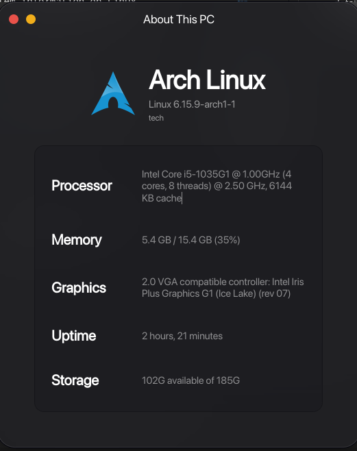

<!-- IMAGINE USING HTML IN MARKDOWN :sob: -->

<center><h1 style="font-family: monospace; font-size: 3.5em; text-shadow: 0px 0px 5px rgba(0, 140, 255, 1)">GuiFetch+</h1>

A fork of [AnmiTaliDev](https://github.com/AnmiTaliDev)'s GuiFetch.

<br>

Modern, GTK4-based system information viewer inspired by macOS's "About This Mac" dialog. GuiFetch+ provides a clean and elegant interface to display detailed system information on Linux.



## Features
- **Clean, modern interface** built with GTK4 and libadwaita
- **Comprehensive system information** including:
  - Operating system details
  - Kernel version
  - Detailed CPU information (with libcpuid support)
  - Memory usage with percentages
  - Graphics card information
  - System uptime
  - Storage information
  - Serial number (when available)
- **Responsive design** that adapts to different window sizes
- **Native Linux integration** with proper desktop file
- **Fast and lightweight** written in Vala and C

### Prerequisites

- GTK4 (>= 4.6)
- libadwaita (>= 1.2)
- GLib (>= 2.70)
- Meson build system
- Vala compiler
- C compiler (GCC or Clang)
- libcpuid (optional, for enhanced CPU detection)

### Ubuntu/Debian

```bash
sudo apt update
sudo apt install build-essential meson valac libgtk-4-dev libadwaita-1-dev libglib2.0-dev libgio2.0-dev libcpuid-dev
```

### Fedora

```bash
sudo dnf install meson vala gtk4-devel libadwaita-devel glib2-devel libcpuid-devel
```

### Arch Linux

```bash
sudo pacman -S meson vala gtk4 libadwaita glib2 libcpuid
```

### Building from Source
1. Clone the repository:
```bash
git clone https://github.com/realbxnnie/guifetch
```

2. Create a build directory:
```bash
meson setup builddir
```

3. Compile the application:
```bash
meson compile -C builddir
```

4. Install (optional):
```bash
sudo meson install -C builddir
```

### Running

After building, you can run GuiFetch+ directly:
```bash
./builddir/src/guifetch
```

Or if installed system-wide:
```bash
guifetch
```

## Dependencies

### Required

- **GTK4** - Modern toolkit for creating graphical user interfaces
- **libadwaita** - Building blocks for modern GNOME applications
- **GLib** - Low-level core library for GNOME applications
- **GIO** - Modern, easy-to-use VFS API

### Optional

- **libcpuid** - Provides enhanced CPU detection and detailed processor information

## Architecture

GUIFetch is built with a hybrid approach:

- **Frontend**: Written in Vala using GTK4 and libadwaita for a modern, native Linux experience
- **Backend**: System information gathering implemented in C for performance and direct system access
- **Resources**: SVG graphics embedded using GResource for a self-contained binary

### Key Components

- `src/main.vala` - Main application logic and UI construction
- `src/info.c` - System information gathering functions
- `src/info.h` - C header definitions for Vala interop
- `src/guifetch.gresource.xml` - Resource bundle configuration

## Contributing

Contributions are welcome! Please feel free to submit a Pull Request. For major changes, please open an issue first to discuss what you would like to change.

### Development Setup

1. Fork the repository
2. Create your feature branch (`git checkout -b feature/amazing-feature`)
3. Make your changes
4. Test your changes (`meson test -C builddir`)
5. Commit your changes (`git commit -m 'Add some amazing feature'`)
6. Push to the branch (`git push origin feature/amazing-feature`)
7. Open a Pull Request

### Code Style

- Follow standard Vala conventions for the UI code
- Use clear, descriptive function names in C code
- Keep functions focused and single-purpose
- Add comments for complex logic

## License

This project is licensed under the GPL-3.0 License - see the [LICENSE](LICENSE) file for details.

## Acknowledgments

- Inspired by macOS "About This Mac" dialog
- Built with the excellent GTK4 and libadwaita libraries
- Logo adapted from the classic Tux penguin
- Thanks to the GNOME project for the amazing development tools

## Support

If you encounter any issues or have questions:

1. Check the [Issues](https://github.com/AnmiTaliDev/guifetch/issues) page
2. Create a new issue with detailed information about your problem
3. Include your distribution, GTK version, and any error messages

---

<span style="font-family: 'serif'; font-size: 2em;">Made with ❤️ by [realbxnnie](https://github.com/realbxnnie)</span>
</center>