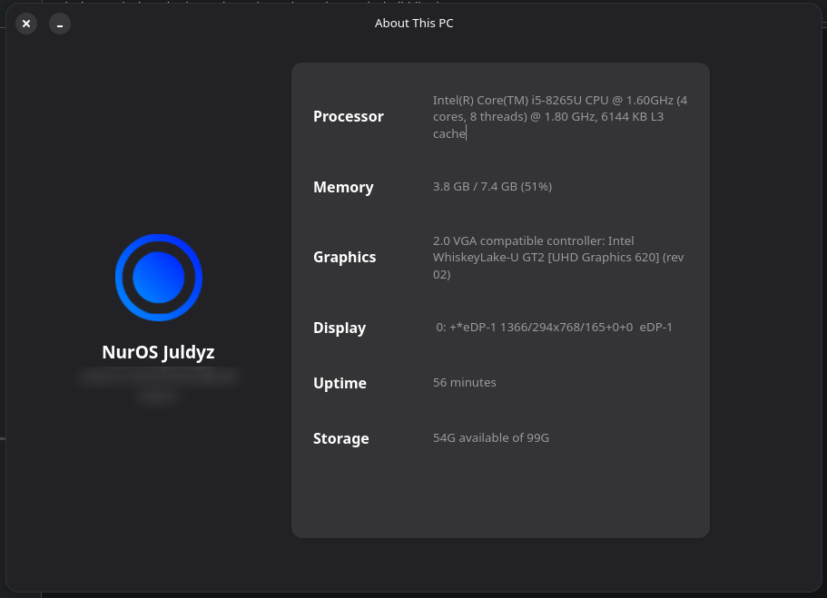

<div align="center">

# 🖥️ GUIFetch+  
*A better way to get system information on Linux*  

[](https://github.com/realbxnnie/guifetch/releases)  
  

Modern, GTK4-based system information viewer inspired by macOS' **"About This Mac"** dialog.  
GUIFetch+ provides a **clean and elegant interface** to display detailed system information.



---

### 🌟 Features

- **✨ Modern GTK4 interface** with libadwaita  
- **💻 Comprehensive system info**:
  - OS details & kernel version
  - CPU info (with libcpuid support)
  - Memory usage with percentages
  - GPU information
  - System uptime
  - Storage info
  - Serial number (when available)
- **📐 Responsive design** for any window size  
- **🖥️ Native Linux integration**  
- **⚡ Fast & lightweight** (Vala + C)

---

### 🛠️ Dependencies

| Library | Purpose |
|--------|---------|
| GTK4 ≥ 4.6 | GUI toolkit |
| libadwaita ≥ 1.2 | Modern GNOME components |
| GLib ≥ 2.70 | Core library |
| GIO | Virtual file system API |
| libcpuid | Optional: enhanced CPU info |
| Gee ≥ 0.8 | Collections framework |

**Ubuntu/Debian:**  
```bash
sudo apt update
sudo apt install build-essential meson valac libgtk-4-dev libadwaita-1-dev libglib2.0-dev libgio2.0-dev libcpuid-dev libgee-0.8-dev
```

**Fedora:**  
```bash
sudo dnf install meson vala gtk4-devel libadwaita-devel glib2-devel libcpuid-devel libgee-devel
```

**Arch Linux:**  
```bash
sudo pacman -S meson vala gtk4 libadwaita glib2 libcpuid libgee
```

---

### ⚙️ Build & Run

```bash
git clone https://github.com/nuros-linux/ats
meson setup builddir
meson compile -C builddir
sudo meson install -C builddir  # optional
```

Run:  
```bash
./builddir/src/guifetch   # from build dir
guifetch                  # if installed system-wide
```

---

### 🏗️ Architecture

- **Frontend:** Vala + GTK4 + libadwaita  
- **Backend:** C for fast system info gathering  
- **Resources:** Embedded SVGs via GResource

**Key Files**  
- `src/ui/main.vala` — Main UI logic  
- `src/ui/Logotypes.vala` — Logotypes dictionary  
- `src/info.c` & `src/info.h` — System info functions  
- `data/guifetch.gresource.xml` — Resource bundle

---

### 🤝 Contributing

1. Fork & create a branch (`git checkout -b feature/my-feature`)  
2. Make changes & test (`meson test -C builddir`)  
3. Commit & push  
4. Open a Pull Request  

**Code Style:**  
- Clear, descriptive names  
- Single-purpose functions  
- Comment complex logic  

---

### 📄 License

[GPL-3.0](LICENSE)  

---

### 🎉 Acknowledgments

- Inspired by macOS **"About This Mac"**  
- Built with **GTK4** & **libadwaita**  
- Logo adapted from classic Tux penguin  
- Thanks to the **GNOME Project**  

> [!NOTE]
> If you encounter issues:
> 1. Check the [Issues](https://github.com/nuros-linux/ats/issues) page  
> 2. Create a new issue with detailed info  
> 3. Include your distro, GTK version, and errors

---

<span style="font-family: 'serif'; font-size: 2em;">Made with ❤️ by [realbxnnie](https://github.com/realbxnnie)</span>
</div>
